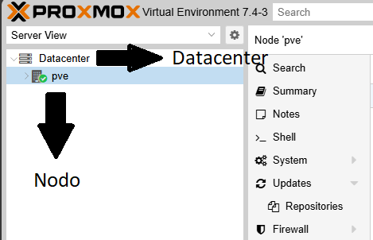
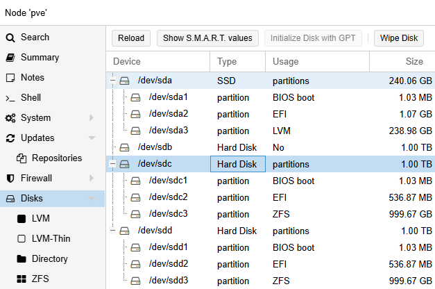
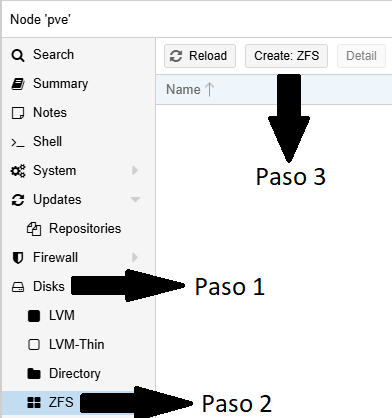
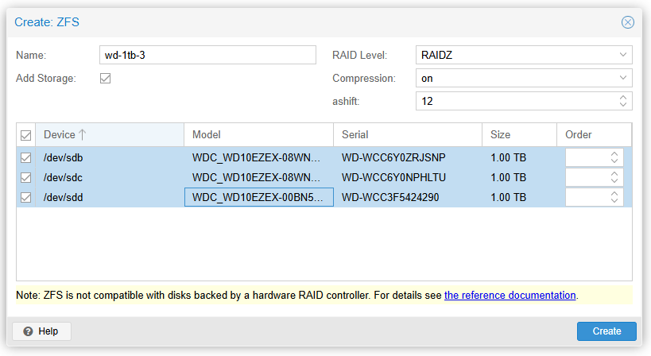
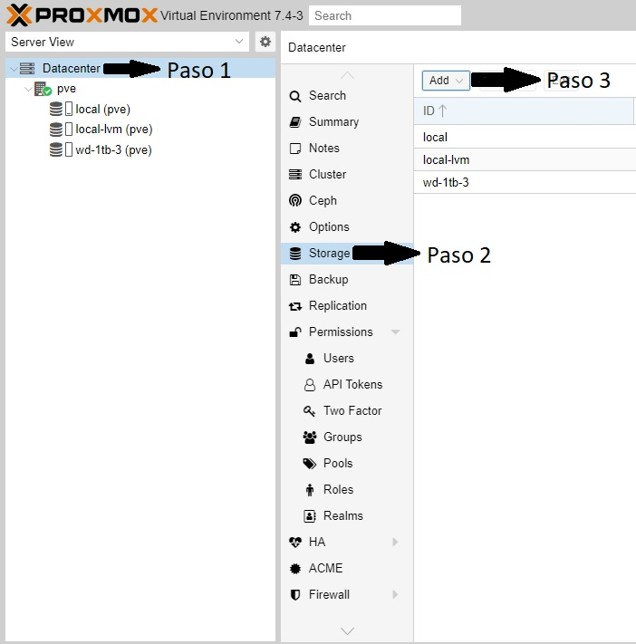
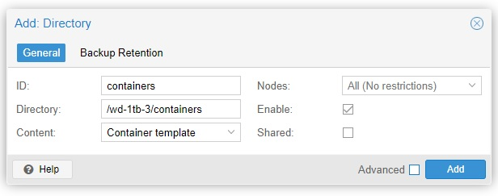
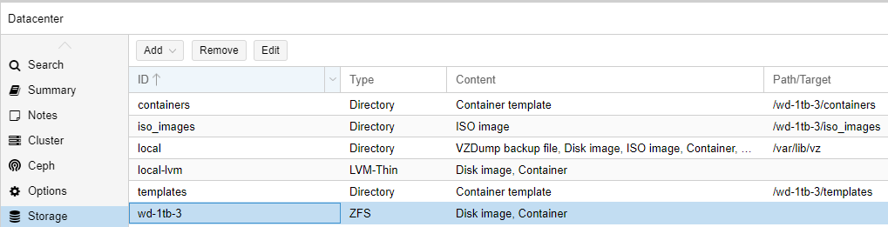

[Volver al Índice](../README.md)

# Formatear discos

Esta parte es crucial, para que al configurar el almacenamiento ZFS RAIDZ podamos agregar todos los discos deseados.
Debemos ir al menú *Disks* de nuestro nodo:



Seleccionemos el/los discos (discos, no particiones) a utilizar. Ahora debemos darle al botón de *Wipe Disk*, y luego *Initialize Disk with GPT*, en ese órden. En la imágen se ven dichos botones.



# Configurar RAIDZ

RAIDZ es el equivalente a RAID 5. Posee paridad simple y requiere al menos 3 discos, lo cuál viene perfecto para mi caso.
Acá podemos observar los [distintos tipos de RAID que ofrece Proxmox mediante ZFS](https://pve.proxmox.com/wiki/ZFS_on_Linux#_installation_as_root_file_system).

Hacemos clic en nuestro nodo deseado (no todo el Datacenter), como se muestra en la imágen:


Ahora, nos dirigimos a *Disks* > *ZFS*. Allí podremos crear un ZFS RAIDZ.



Ahora podremos asignar nuestros discos recién formateados y crear el volúmen ZFS, como se muestra en la imágen.



# Gestionar un ZFS Pool para contenedores

> [!NOTE]  
> Hay buenas prácticas para el nombramiento de volúmenes y datasets, podemos verlo en [Oracle ZFS](https://docs.oracle.com/cd/E23824_01/html/821-1448/gbcpt.html).

Un volúmen o pool ZFS no puede utilizarse directamente para guardar templates de contenedores, contenedores, imágenes ISO, etc. Para asegurarnos que nuestro(s) disco(s) ya forman parte de un pool ZFS, ejecutamos el comando `zpool list`. El output en mi caso, es:

```bash
NAME       SIZE  ALLOC   FREE  CKPOINT  EXPANDSZ   FRAG    CAP  DEDUP    HEALTH  ALTROOT
wd-1tb-3  2.72T   792K  2.72T        -         -     0%     0%  1.00x    ONLINE  -
```

Perfecto, ya tenemos el pool y nos falta el dataset. Para ello podemos tomar el nombre de nuestro pool (en mi caso, *wd-1tb-3*) y utilizarlo en el comando. 

## Crear dataset para los contenedores:

```bash
zfs create wd-1tb-3/containers
```

## Crear dataset para los templates de los contenedores LXC, imágenes ISO y discos virtuales para VMs:

```bash
zfs create wd-1tb-3/templates
zfs create wd-1tb-3/iso_images
zfs create wd-1tb-3/disk_images
```

Ahora debemos marcar estos **dataset** como utilizables. En la interfaz web, nos dirigimos a Datacenter > Storage. Nos aparecerá el listado de dispositivos de almacenamiento, y arriba el botón *Add*.



Al cliquear en el botón **Add** (paso 3), se abrirá un menú desplegable y hacemos nuevamente clic en **Directory**.

En la ventana que se abre a continuación, mi directorio será **containers**, y se montará en el directorio */wd-1tb-3/containers*.



Ya teniendo los 3 configurados:



Ya con esta configuración, nos ahorraremos el error `storage 'wd-1tb-3' does not support templates`, al querer descargar un template para poder ejecutar un contenedor LXC.