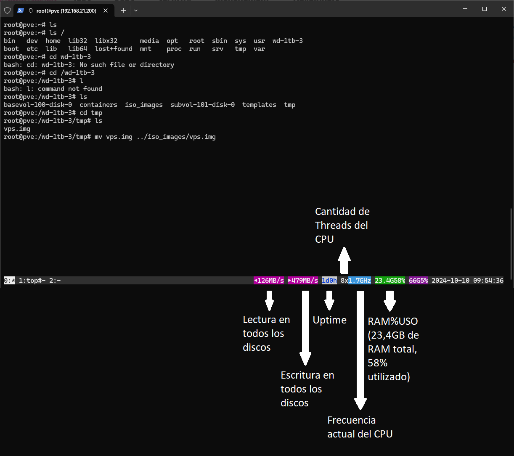

[Volver al Índice](./README.md)

# Introducción

**Byobu** es un emulador de terminal avanzado, que soporta funciones cómo:
- Pestañas / Tabs
- Logs de hostname, ip
- Logs de uso de cpu, ram, hdd, red



Acá se encuentran alguna de sus funciones, que se pueden activar entrando a su menú mediante la tecla **F1** > **Toggle status notifications**.

## Hotkeys

- **F1**: Menú de Byobu
- **F2**: Nueva pestaña
- **F3**: Ir a la pestaña de la izquierda
- **F4**: Ir a la pestaña de la derecha
- **F7**: Scroll vertical
- **F8**: Renombrar pestaña

# Instalación

```bash
apt install byobu
```