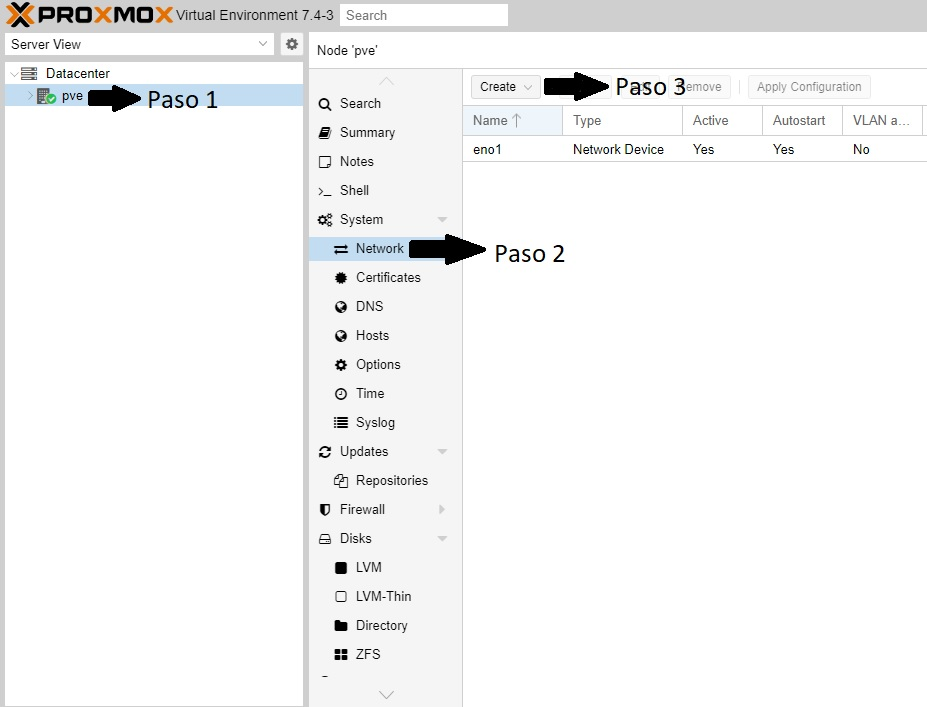

[Volver al Índice](../README.md)

# Interfaz de red "bridge"

En la instalación, algo hice mal y tuve que re-armar mi archivo `/etc/network/interfaces`, por lo cuál en la interfaz de Proxmox no tengo ninguna interfaz de red, además de la física instalada en mi motherboard. Este paso puede que sea necesario, como no. Para saber si **no** necesitas este paso, ve a tu nodo (en mi caso, *pve*) y luego a *System* > ***Network***. Debería haber más de una interfaz de red. En mi caso tengo sólo una, así que procedo a crear una interfaz *bridge* para mis Linux Containers.

Bien, al darle al botón **Create**, procedemos a:
- Darle un nombre (que comience con *vmbr*, seguido de un número del 0 al 9999)
- Brindarle una IP IPv4 (opcionalmente), ejemplo 192.168.21.210/24

~~¡Listo!~~

**Recordá** que debés hacer clic en el botón **Apply Configuration**, que está a la derecha del botón "Remove". Esto aplicará los cambios a las nuevas interfaces de red, sin requerir reinicio del servidor.
