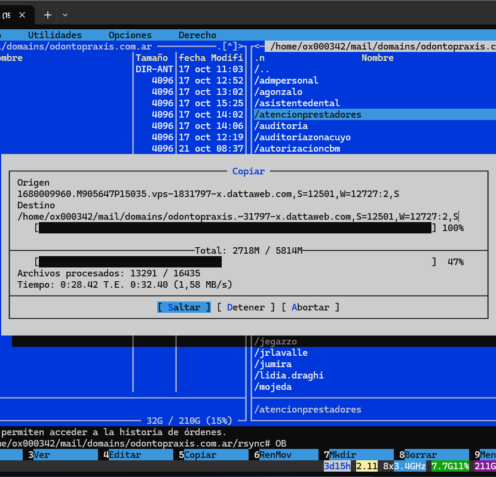
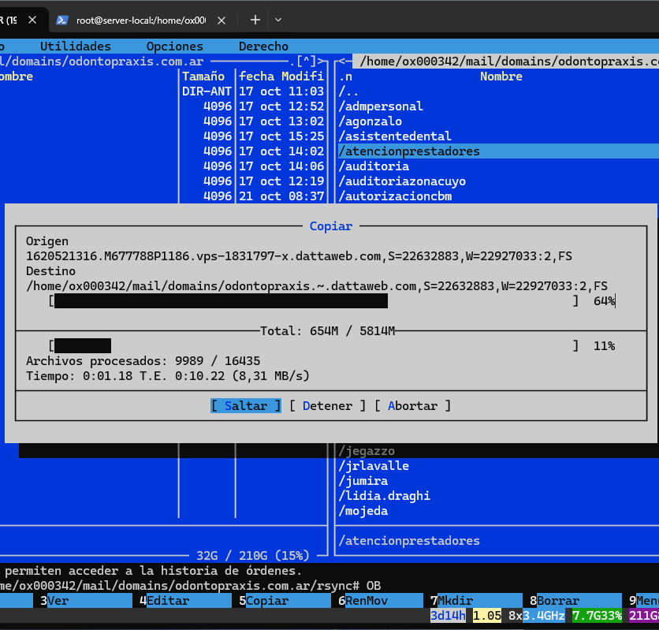

# Introducción

Desde que instalé Debian en mi primera VM, noté que se instaló mucho más lento de lo normal. Sobretodo porque tengo configurado un RAIDZ (RAID 5) en Proxmox, lo cuál me otorga redundancia y, también mejor performance (en teoría).

Acá podemos ver la velocidad más alta y más baja, sin ningún tipo de tweak:

| Velocidad más baja (1,58MB/s) | Velocidad más alta (8,31MB/s) |
| ------------------ | ------------------ |
|  |  |
