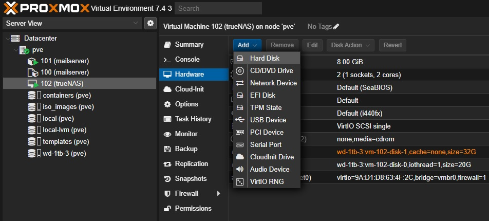

# Introducción

Añadir un disco (o cualquier componente) no es trivial, gracias a la sencilla interfaz de Proxmox.

Simplemente seleccionamos la VM, dentro de nuestro nodo (menú a la extrema izquierda), y en el nuevo menú que aparece, vamos a **Hardware** > **Add** > **Hard disk** (o el dispositivo que requieras).

Allí se abrirá una ventana, para poder indicar el volúmen ZFS dónde se guardará y el tamaño de esta nuevo **Hard disk**.