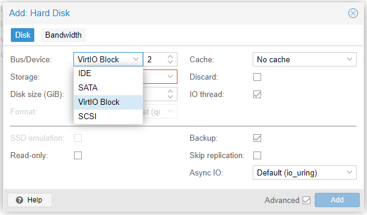

# Introducción

Añadir un disco (o cualquier componente) no es trivial, gracias a la sencilla interfaz de Proxmox.

Simplemente seleccionamos la VM, dentro de nuestro nodo (menú a la extrema izquierda), y en el nuevo menú que aparece, vamos a **Hardware** > **Add** > **Hard disk**.

Allí se abrirá una ventana, para poder indicar el volúmen ZFS dónde se guardará y el tamaño de este nuevo **Hard disk**.

# Tipos de Buses

- IDE: ampliamente compatible con cualquier sistema operativo, no precisa drivers extra
- SATA: muy compatible, a partir de Windows XP en adelante. Más rápido que IDE.
- VirtIO Block: precisa drivers en sistemas guest Windows, pero no en Linux/FreeBSD. Ideal para aplicaciones dónde se precisa un rendimiento excelente, con grandes cargas en el IO.
- SCSI: precisa drivers y no tiene tantas optimizaciones como VirtIO Block. Si no se puede instalar el driver de VirtIO por algún motivo, la segunda mejor opción es SCSI.
