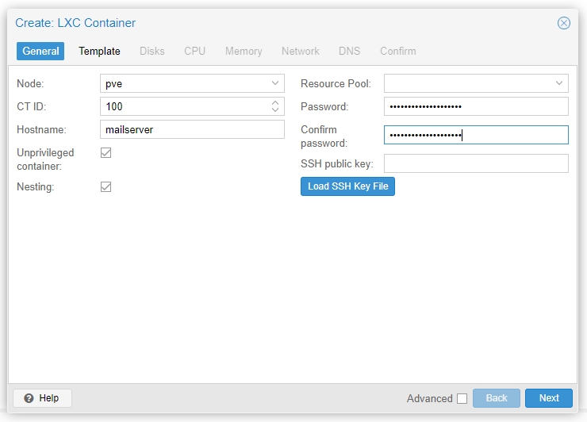
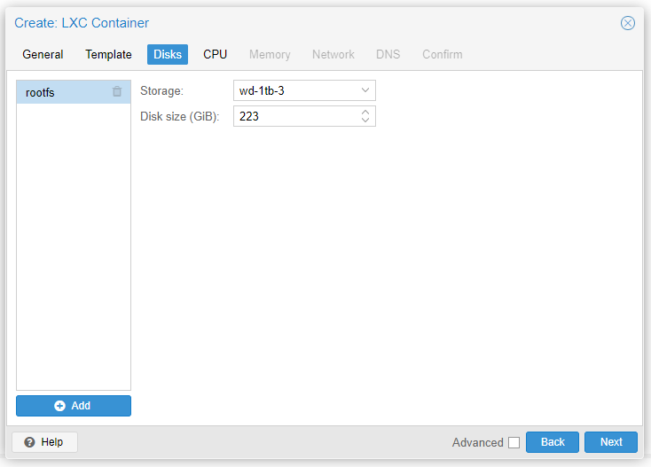
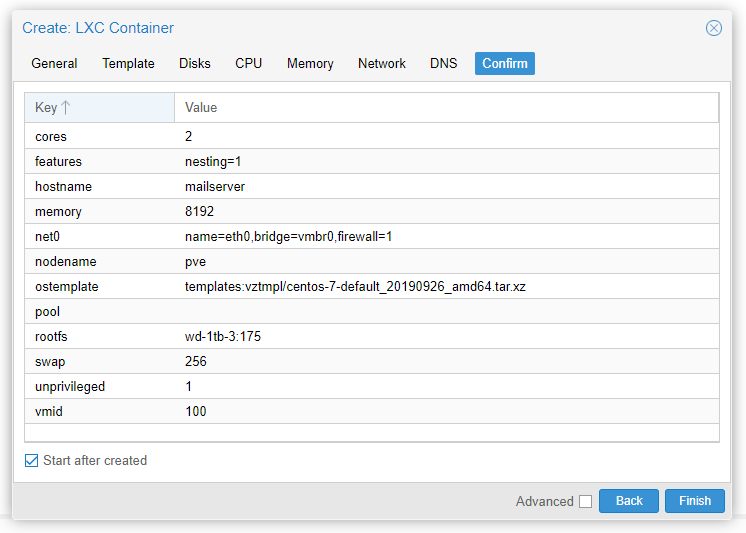
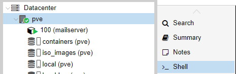

[Volver al Índice](./README.md)

# Creación del contenedor

Por fin, ya tenemos todo configurado. Este proceso de generar un nuevo pool ZFS y dataset(s), se hace por única vez, al menos que instales un nuevo dispositivo de almacenamiento y quieras utilizarlo, por ejemplo, para guardar *container templates*.

En la interfaz web, arriba a la derecha veremos que hay un botón que se llama **Create CT**. Le hacemos clic y se abrirá esta ventana, que ya está pre-completada por mi (crearé un mailserver, vos deberás tener un hostname y contraseña propias).

Al completar los campos requeridos, el botón **Next** permitirá que le hagamos clic. 

En la siguiente pantalla tenemos solo dos opciones:

Yo asigné **templates** como dataset, en la opción *Storage*, y **centos-7-default_20190926_amd64** en la opción de *Template*. Recordemos que esta imágen de contenedor fue descargada anteriormente por mi (con el comando `pveam download wd-1tb-3/templates centos-7-default_20190926_amd64.tar.xz`), y ustedes seguramente habrán descargado otra, pero asumo que ya entendieron el concepto :D

> [!TIP]  
> CentOS 7 usa una versión vieja del *daemon* **Systemd**, y Proxmox arrojó el warning `old systemd (< v232) detected, container won't run in a pure cgroupv2 environment`.
> La desventaja de un systemd tan antiguo, es que no aprovecha todas las funciones y optimizaciones de **Cgroup v2**, y por ende se pierde rendimiento.
>
> > *Yo posteriormente creé un LXC en mi servidor de laboratorio, llamado mailserver (ID: 100), que lo transformé en template para su posterior re-utilización. Es un CentOS 9 + Docker pre-instalado, y así se armó el mailserver pedido por Juan David. La documentación de ese contenedor LXC, basado en CentOS 9, está fuera de éste.*

Al darle **Next**, nos encontraremos con la siguiente pantalla para poder asignar el dispositivo de almacenamiento, dónde residirá nuestro contenedor LXC. Si me hicieron caso, ya tenemos configurado nuestro pool ZFS con *un dataset exclusivo para los contenedores*, así que podremos usar esta unidad. Así quedó mi ventana seteada:

Le damos **Next**, y en la pestaña **CPU** asignamos la cantidad de núcleos (Cores). **Next** de nuevo y podremos setear la memoria y el swap. Yo en mi caso, configuré 8192MB (8GB) para la memoria y 256MB para el swap (para replicar el área de intercambio del servidor VPS, por si acaso).

Procedemos un paso más, hasta la pestaña *Network*. Allí le daremos un nombre a la interfaz **del contenedor**, y estableceremos que bridge usar. Deberíamos tener uno sólo, pero si tienen más, creo que no es un problema 🤣.

Le damos a **Next** dos veces, ya que en la pestaña *DNS* tampoco precisamos cambiar nada. La pestaña de confirmación, luce algo así:

Si seleccionamos la opción *Autostart*, nos brindará un output conforme inicie el contenedor, que por cierto es un proceso bastante rápido.

# Entrar al contenedor desde Proxmox

Al crear el contenedor, no podía ingresar por SSH y en la opción *Console* del container, no me aparecía ninguna shell. Para poder diagnosticar qué pasa, podemos entrar al contenedor desde la *Shell* del nodo (en mi caso, pve).

Una vez en la consola del nodo, y suponiendo que el ID de nuestro contenedor es 100, realizamos el comando `pct enter 100`, y ya podremos operar dentro de este sistema anfitrión.